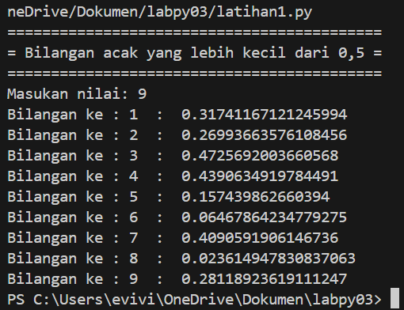
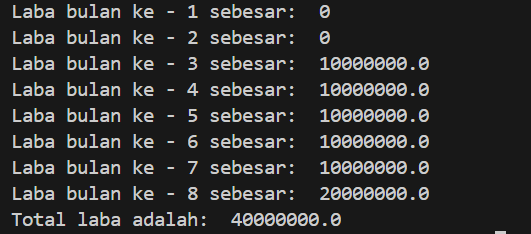
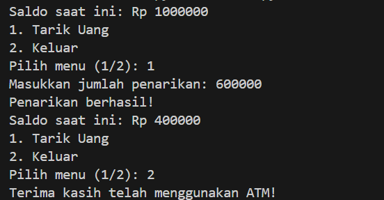

# Latihan Program Python

Repository ini berisi tentang dua buah kode program yang berfungsi untuk men-generate angka random dan tentang perhitungan profit dari investasi.

## Table of Contents

- [Programs](#programs)
  - [Random Number Generator (latihan1.py)](#random-number-generator-latihan1py)
  - [Investment Profit Calculator (latihan2.py)](#investment-profit-calculator-latihan2py)
  - [ATM Sederhana (latihan3.py)](#atm-sederhana-latihan3py))
- [Cara menjalankan](#how-to-run)
- [Program Details](#program-details)

## Programs

### Random Number Generator (latihan1.py)

Sebuah program yang akan menggenerate angka random kurang dari 0.5 berdasarkan input user.

#### Algorithm:

python
1. Import random library
2. Minta input N dari user
3. Loop N times:
   - Generate random number between 0 and 1
   - Bagi dengan 2 untuk memastikan angka < 0.5
   - Tampilkan output
4. Print "Selesai" saat selesai

#### Example Output:

bash
Masukkan nilai N: 5
data ke: 1 => 0.17294922043570056
data ke: 2 => 0.08717360127477924
data ke: 3 => 0.050516076545020832
data ke: 4 => 0.27535124215716744
data ke: 5 => 0.39262323600723776
Selesai

### Investment Profit Calculator (latihan2.py)

Program yang menghitung laba bulanan untuk investasi selama 8 bulan dengan tingkat laba yang bervariasi.

#### Algorithm:

python
1. Tetapkan modal awal = 100.000.000
2. Buat list kosong untuk menyimpan laba bulanan
3. Lakukan perulangan selama 8 bulan:
   - Bulan 1-2: laba 0%
   - Bulan 3-4: laba 1%
   - Bulan 5-7: laba 5%
   - Bulan 8: laba 2%
4. Untuk setiap bulan:
   - Hitung laba berdasarkan persentase
   - Tampilkan laba bulanan
   - Simpan laba dalam list
5. Hitung dan tampilkan total laba

#### Example Output:

bash
laba bulan ke- 1 sebesar: 0
laba bulan ke- 2 sebesar: 0
laba bulan ke- 3 sebesar: 10000000.0
laba bulan ke- 4 sebesar: 10000000.0
laba bulan ke- 5 sebesar: 50000000.0
laba bulan ke- 6 sebesar: 50000000.0
laba bulan ke- 7 sebesar: 50000000.0
laba bulan ke- 8 sebesar: 20000000.0
Total laba adalah: 190000000.0

### ATM Sederhana (latihan3.py)

Program iSni akan mensimulasikan mesin ATM sederhana dengan fitur penarikan uang dan pengecekan saldo.

## Fitur Program ATM

1. Menampilkan saldo
2. Penarikan uang
3. Keluar dari program

#### Algorithm:

python
1. Inisialisasi:
   - Set saldo awal = Rp 1.000.000

2. Mulai perulangan utama:
   a. Tampilkan informasi:
      - Saldo saat ini
      - Menu pilihan (1. Tarik Uang, 2. Keluar)

   b. Minta input pilihan menu dari pengguna

   c. Jika pilihan = 1 (Tarik Uang):
      - Minta input jumlah penarikan
      - Cek apakah jumlah <= saldo
      - Jika ya: kurangi saldo dan tampilkan pesan sukses
      - Jika tidak: tampilkan pesan saldo tidak cukup

   d. Jika pilihan = 2 (Keluar):
      - Tampilkan pesan terima kasih
      - Keluar dari program

   e. Jika pilihan tidak valid:
      - Tampilkan pesan error
      - Kembali ke awal perulangan

3. Program selesai

## How to Run

1. Pastikan Python 3.x sudah terinstal di sistem Anda
2. Clone repositori ini:

bash
git clone [repository-url]

3. Pindah ke direktori program:

bash
cd [repository-name]

4. Run the programs:

bash
python3 latihan1.py
python3 latihan2.py
python3 latihan3.py

## Program Details

### latihan1.py

- Menggunakan modul random Python
- Menerapkan validasi input
- Menghasilkan angka dalam rentang [0, 0,5)
- Memformat output sesuai spesifikasi

### latihan2.py

- Modal awal tetap: Rp 100.000.000
- Menghitung laba selama 8 bulan
- Tingkat laba bervariasi:
  - Bulan 1-2: 0%
  - Bulan 3-4: 1%
  - Bulan 5-7: 5%
  - Bulan 8: 2%
- Memberikan rincian laba bulanan
- Menghitung total laba yang terakumulasi

### latihan3.py

### Komponen Utama(ATM Sederhana)

1. *Variabel Saldo*

   - Menyimpan jumlah saldo yang tersedia
   - Diinisialisasi dengan nilai Rp 1.000.000

2. *Loop Utama*

   - Menggunakan while True untuk menjalankan program terus-menerus
   - Berhenti hanya jika user memilih keluar

3. *Validasi Input*
   - Memastikan pilihan menu valid (1 atau 2)
   - Memastikan jumlah penarikan tidak melebihi saldo

### Batasan Program (ATM Sederhana)

- Saldo awal tetap: Rp 1.000.000
- Hanya menyediakan fitur penarikan
- Tidak ada fitur penyimpanan data permanen
